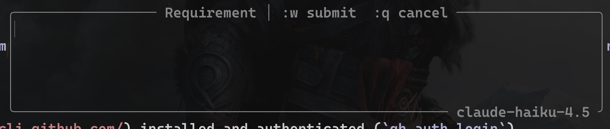

# dum.nvim

Ask GitHub Copilot to complete a **visual selection** using the minimum possible context — only the selected fragment and your requirement are sent, nothing else from the file.

Plugin is heavily inspired by the workflow frm [99](https://github.com/ThePrimeagen/99) - tradcoders' AI agent :D

Since 99 works with all providers, but not with copilot directly - I created something that does it and does it the way I like it.

> ℹ️ This is heavily opinionated. It's supposed to work for **ME**, not anyone else. Though PRs appreciated



## Why "dum"

Regular LLMs are cool and everything, but I want something that gives me the ability to work precisely how I need

I want the LLM to do precise, short things.

So I named it `dum`. Because AI is kinda dum-dum. `"Dum dum" (or dum-dum) is primarily slang for a silly, stupid, or foolish person`

## Requirements

- Neovim ≥ 0.10
- [`gh`](https://cli.github.com/) installed and authenticated (`gh auth login`)
- `curl` available in `$PATH`
- A GitHub account with Copilot access

## Installation

### lazy.nvim

```lua
{
  "ochcaroline/dum.nvim",
  config = function()
    require("dum").setup()
  end,
}
```

## Usage

1. Select code in **visual mode** (`v`, `V`, or `<C-v>`).
2. Press `<leader>ch` (default).
3. Type your requirement and press `:w` to submit (`:q` to cancel).
4. Copilot streams the completion into the selection in real-time. The change is fully undoable.

Press **`<leader>chc`** (or `:DumCancel`) at any time to abort an in-flight request.

## Configuration

```lua
require("dum").setup({
  keymap        = "<leader>ch",   -- visual-mode keybinding
  cancel_keymap = "<leader>chc",  -- normal-mode cancel keybinding
  model         = "claude-sonnet-4.6", -- Copilot model

  -- Optional extra instructions appended to the system prompt per filetype.
  filetype_prompts = {
    go  = "Follow standard Go idioms and use named return values where appropriate.",
    lua = "Follow Neovim Lua conventions. Prefer vim.api over legacy vimscript calls.",
  },
})
```

## How it works

- The **stripped selected lines** (with some basic context information) and your **requirement** are sent to the Copilot Chat Completions API with **streaming** enabled.
- Completion tokens are written into the buffer in real-time as they arrive.
- The context information: filetype, filename; optionally extended via `filetype_prompts`.
- The plugin exchanges your `gh` OAuth token for a short-lived Copilot token (cached for ~30 minutes). The token cache is stored at `stdpath("data")/dum/tokens.json` with `0600` permissions.
- Common leading indentation is stripped before sending and restored on the result, keeping diffs clean.
- All streaming writes are joined into a single undo entry — one `u` reverts the entire completion.
